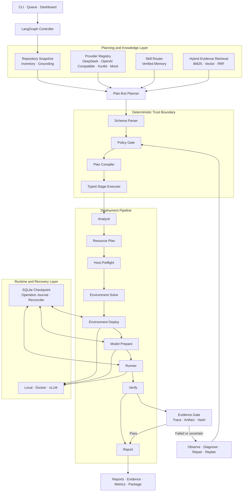
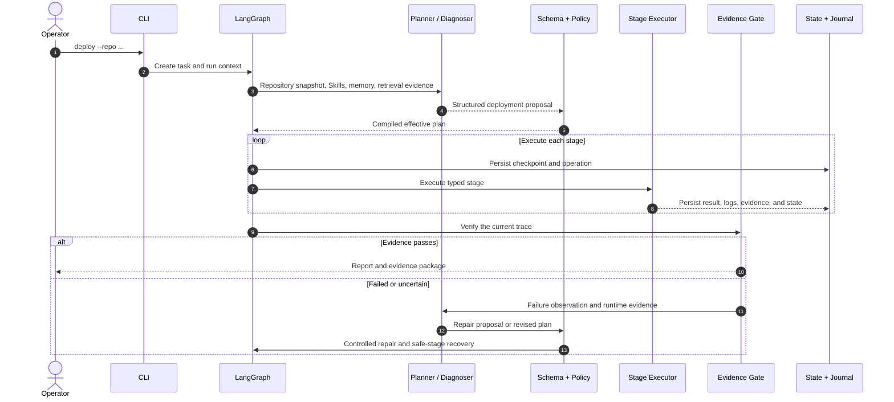

<div align="center">

# Auto Deploy Harness

**English** | [简体中文](README.zh-CN.md)

<p><strong>A secure auto-deployment and evidence-based verification agent for open-source AI projects</strong></p>

Turn repository analysis, environment resolution, model preparation, service startup, recovery, and verification into one auditable deployment pipeline.

[](https://github.com/liudawang001/auto-deploy-harness/actions/workflows/ci.yml)
[](https://www.python.org/)
[](https://github.com/langchain-ai/langgraph)
[](LICENSE)

[Quick Start](#quick-start) · [Architecture](#system-architecture) · [Capabilities](#core-capabilities) · [CLI](#command-line-interface) · [Security](#security-model)

</div>

---

## Project Overview

Auto Deploy Harness is a Python-controlled deployment agent orchestrated with LangGraph. It analyzes AI repositories—including Gradio, Streamlit, FastAPI, Flask, Node, PyTorch, Transformers, and vLLM projects—then produces a deployment plan and executes it under explicit policy controls.

The LLM operates in the **planning and diagnosis layer**, while authority, execution, and success criteria remain in the **deterministic control layer**:

- The LLM proposes structured deployment plans, verification strategies, and repairs; it never operates a shell directly.
- Schema validation, the Policy Gate, and the Plan Compiler turn proposals into constrained execution plans.
- A typed stage executor handles environments, models, processes, and verification.
- The Evidence Gate accepts only trace, artifact hash, or protocol evidence produced by the current run.
- Checkpoints, the Operation Journal, and reconcilers prevent duplicate side effects during recovery.

## Core Capabilities

| Capability | Description |
|---|---|
| Repository understanding and Plan-first execution | Detects project structure, frameworks, entry points, dependencies, run commands, and verification protocols to create a traceable structured plan |
| Multi-environment resolution | Supports `venv`, Conda, Mamba, Micromamba, and Docker, with Python, CUDA, Torch, and GPU-aware environment planning |
| Model asset management | Detects Hugging Face, ModelScope, Git LFS, submodules, and local weights, with manifests, caching, resume, parallel downloads, and integrity checks |
| Controlled agent execution | JSON Action and Native Tools share the same Schema, Policy, Tool Registry, Ledger, and deterministic Executor |
| Evidence-based verification | Supports HTTP traces, Gradio API/Queue, OpenAPI, Streamlit DOM, browser probes, and OpenAI-compatible streaming responses |
| Self-healing loop | Performs bounded failure observation, structured diagnosis, policy-gated repair, human approval, and safe-stage reruns |
| Crash-safe recovery | Uses SQLite checkpoints, stable operation IDs, the Operation Journal, and resource reconciliation for downloads, environments, processes, and containers |
| Skills and memory | Routes bundled Skills by stage, records verified memory, and evolves capabilities through approval, regression, shadow evaluation, and hash-chain audits |
| Operational tooling | Includes a persistent queue, static dashboard, cost profiling, benchmarks, readiness audits, and deployment evidence packages |

## System Architecture



### Deployment Lifecycle



## Quick Start

### Requirements

- Python 3.10+
- Git
- Docker, Conda/Mamba, GPU support, and Playwright as required by the target project

### Install from Source

```bash
git clone https://github.com/liudawang001/auto-deploy-harness.git
cd auto-deploy-harness

python3 -m venv .venv
source .venv/bin/activate
python -m pip install --upgrade pip
python -m pip install -e .

auto-deploy-harness init
```

`init` installs the bundled default configuration and eight deployment Skills while preserving existing local files.

### Run Your First Deployment Plan

Run a local dry-run without an external API:

```bash
auto-deploy-harness deploy \
  --repo tests/fixtures/e2e/http_trace_echo \
  --name quickstart \
  --dry-run \
  --agent-provider mock \
  --agent-plan-first-provider mock
```

A dry-run completes repository analysis, planning, policy validation, and report generation without installing dependencies or starting a service.

### Use the Default DeepSeek Provider

```bash
export DEEPSEEK_API_KEY="sk-..."

auto-deploy-harness llm-test
auto-deploy-harness deploy --repo /path/to/your-project --name my-project --dry-run
```

`--repo` accepts either a local path or a Git HTTP(S) URL. Every run prints a unique `task-id` used for status, recovery, reports, and packaging.

### Execute a Deployment

```bash
auto-deploy-harness deploy \
  --repo https://github.com/example/ai-demo.git \
  --name ai-demo \
  --execute \
  --allow-install \
  --allow-start \
  --agent-self-heal \
  --execution-backend docker
```

Dependency installation and service startup require `--execute`, the corresponding authorization flags, and approval from the command policy. The local backend is suitable for trusted repositories; the Docker backend provides separate installation, runtime, and verification profiles.

## Deployment Pipeline

| Stage | Responsibility | Representative artifacts |
|---|---|---|
| `analyze` | Detect frameworks, entry points, dependencies, runner candidates, and verification hints | `analyze_result.json`, `project_snapshot.json` |
| `resource_plan` | Identify model assets, GPU/CUDA, disk, and credential requirements | `resource_plan_result.json` |
| `host_preflight` | Probe GPUs, drivers, Conda runtimes, and existing environments | `preflight/host_capabilities.json` |
| `env_solve` | Resolve Python, dependencies, Torch/CUDA, and the environment backend | `env_solve_result.json` |
| `env_deploy` | Create or reuse an environment under Policy Gate controls | `env_deploy_result.json` |
| `model_prepare` | Create asset manifests, populate caches, and prepare model files | `model_assets_manifest.json` |
| `runner` | Select a controlled command and start a local process, container, or model service | `runner_result.json`, `logs/runner.log` |
| `verify` | Validate the current trace through service responses, DOM state, or file artifacts | `verify_result.json`, `evidence/*` |
| `report` | Aggregate the plan, execution, recovery, agent contribution, and verification evidence | `reports/report.md` |

## How the Agent Works

### Plan-first

The planner receives a repository inventory, bounded file evidence, Skills, memory, and optional retrieval results, then produces a structured deployment proposal. The raw proposal and effective plan are stored separately:

```text
runs/<task-id>/reports/llm_deployment_plan.raw.json
runs/<task-id>/reports/llm_deployment_plan.parsed.json
runs/<task-id>/reports/llm_plan_policy.json
runs/<task-id>/reports/effective_deployment_plan.json
```

### Provider Protocols

- `json_action`: the provider returns structured actions that the framework parses, evaluates, and executes.
- `native_tools`: the provider expresses intent through native tool calling while the same Policy, Executor, and Tool Call Ledger retain control.

Built-in Provider Registry:

```text
deepseek · openai · openai_compatible · qwen · dashscope
volcengine · zhipu · vllm · ollama · xunfei · mock
```

Temporarily override the model and context budget from the CLI:

```bash
auto-deploy-harness deploy \
  --repo ./project \
  --model deepseek-v4-pro \
  --context-window-tokens 262144 \
  --max-output-tokens 16384 \
  --dry-run
```

Configuration precedence is: CLI arguments → provider environment variables → generic environment variables → configuration file → provider defaults.

### Evidence Retrieval

The optional retrieval layer is designed specifically for deployment evidence and supports lexical, dense, and hybrid modes:

```bash
auto-deploy-harness deploy \
  --repo ./project \
  --retrieval \
  --retrieval-mode lexical \
  --retrieval-top-k 8 \
  --dry-run
```

Retrieved items remain candidate context. Repository files are read precisely and their SHA values are verified before they can ground an effective plan.

### Self-healing and Resume

`--agent-self-heal` enables a bounded observe → diagnose → repair → policy → resume loop. After policy approval, repairs restart from an allowed safe stage. Completed stages can be reused, while side-effect stages reconcile external state before proceeding.

```bash
auto-deploy-harness status --task-id <task-id>
auto-deploy-harness resume --task-id <task-id> --execute

auto-deploy-harness approval-show --task-id <task-id>
auto-deploy-harness approval-resolve \
  --task-id <task-id> \
  --decision approve \
  --reviewer operator \
  --execute
```

## Evidence and Run Artifacts

Every task receives an isolated run directory:

```text
runs/<task-id>/
├── task.json                 # Immutable task specification
├── state.json                # User-visible stage state
├── events.jsonl              # State event stream
├── workspace/repo/           # Isolated target repository copy
├── checkpoints/              # LangGraph SQLite checkpoints
├── operations/               # Side-effect journal and recovery snapshots
├── approvals/                # Human approval records
├── evidence/                 # Trace, HTTP, DOM, and artifact evidence
├── logs/                     # Runtime logs
├── repairs/                  # Repair plans, policies, and apply results
└── reports/
    ├── effective_deployment_plan.json
    ├── pipeline_results.json
    ├── controller_result.json
    ├── agent_contribution.json
    └── report.md
```

Common inspection and export commands:

```bash
auto-deploy-harness report --task-id <task-id>
auto-deploy-harness package --task-id <task-id> --include-logs
auto-deploy-harness dashboard --serve --host 127.0.0.1 --port 8765
auto-deploy-harness cost-profile --task-id <task-id>
```

## Command-line Interface

| Use case | Commands |
|---|---|
| Initialization | `init` |
| Deployment and recovery | `deploy`, `resume`, `status`, `report` |
| Host and runtime | `preflight`, `docker-smoke`, `cache` |
| Approval and repair | `approval-show`, `approval-resolve`, `repair-approve` |
| Queue and visualization | `queue submit/list/run`, `dashboard` |
| Evaluation and auditing | `benchmark`, `readiness`, `agent-metrics`, `cost-profile`, `eval-compare`, `eval-llm-necessity` |
| Evidence and delivery | `package`, `evidence-package` |
| Skills and memory | `memory-evolve`, `skill-outcomes`, `skill-gain`, `skill-rollback` |
| Provider validation | `llm-test`, `agent-live-smoke`, `live-smoke-plan` |

View complete options for any command:

```bash
auto-deploy-harness --help
auto-deploy-harness deploy --help
```

CLI exit codes: `0` completed or completed dry-run, `1` stopped or partially completed, `2` argument/configuration error, `3` execution failure, and `130` user interruption.

## Configuration

The main configuration file is [`configs/default.json`](configs/default.json). Set `AUTO_HARNESS_CONFIG` to use a custom file:

```bash
export AUTO_HARNESS_CONFIG=/path/to/harness.json
```

Common runtime options:

| Option | Purpose |
|---|---|
| `--execution-backend local\|docker` | Select the execution isolation model |
| `--env-backend auto\|venv\|conda\|mamba\|micromamba` | Select the dependency environment backend |
| `--require-gpu` | Make GPU availability a deployment constraint |
| `--allow-cpu-fallback` | Allow a compatible CPU execution plan |
| `--model-inference` | Enable the model preparation and vLLM inference chain |
| `--agent-self-heal` | Enable policy-constrained diagnosis and repair |
| `--retrieval` | Enable deployment evidence retrieval |

## Security Model

Auto Deploy Harness strictly separates model proposals from machine authority:

1. **Repository boundary**: read-only observation stays inside the target repository; sensitive files are rejected or redacted.
2. **Structured input**: the LLM can return only schema-defined plans, actions, or tool calls.
3. **Policy enforcement**: commands, paths, package specifications, network access, environment variables, and side effects are decided locally by the Policy Gate.
4. **Explicit authorization**: installation, startup, source modification, and high-risk recovery require runtime authorization or human approval.
5. **Execution isolation**: the target project runs in an isolated workspace with optional layered Docker profiles.
6. **Secret isolation**: provider credentials are excluded from target project child processes; reports record required variable names only.
7. **Evidence-based outcomes**: HTTP 200, a live process, or an LLM judgment cannot independently prove success; the current trace must be observed.
8. **Recoverable side effects**: critical operations use stable IDs, atomic journals, and ownership markers, and are reconciled against real resource state before recovery.

Report security issues privately by following [`SECURITY.md`](SECURITY.md).

## Development and Testing

```bash
python -m pip install -e '.[dev]'
python -m ruff check src tests
pytest -q

auto-deploy-harness benchmark \
  --manifest tests/fixtures/benchmarks/manifest.json \
  --output benchmark_report.json
```

The repository includes regression tests and local end-to-end fixtures for planning, environments, model assets, recovery, verification, repair, Skills, queueing, dashboards, and security policy.

Read [`CONTRIBUTING.md`](CONTRIBUTING.md) before submitting changes. Release history is available in [`CHANGELOG.md`](CHANGELOG.md).

## License

Licensed under the [Apache License 2.0](LICENSE).
