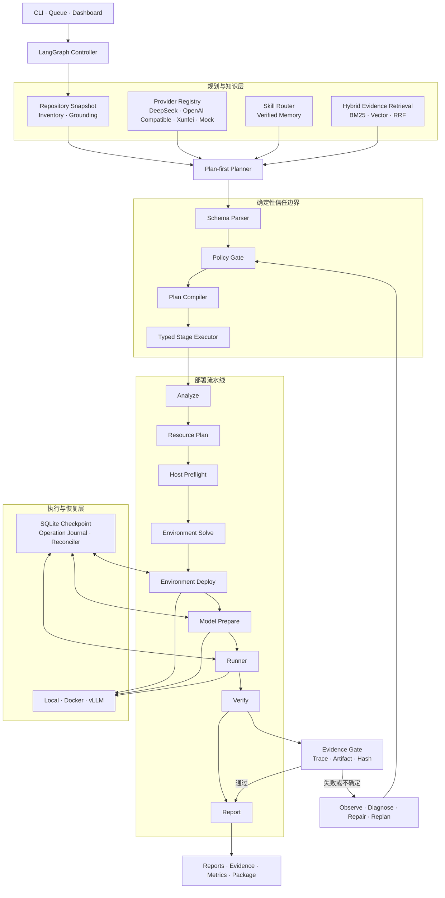
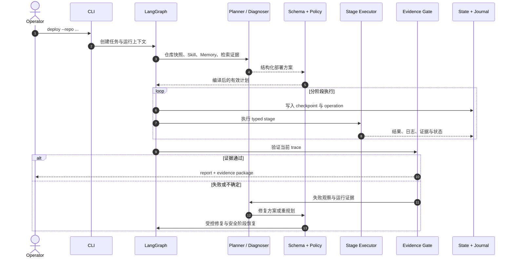

<div align="center">

# Auto Deploy Harness

[English](README.md) | **简体中文**

<p><strong>面向 AI 开源项目的安全自动部署与证据化验证 Agent</strong></p>

将仓库理解、环境求解、模型准备、服务启动、故障恢复与结果验证编排为一条可审计的部署流水线。

[](https://github.com/liudawang001/auto-deploy-harness/actions/workflows/ci.yml)
[](https://www.python.org/)
[](https://github.com/langchain-ai/langgraph)
[](LICENSE)

[快速开始](#快速开始) · [系统架构](#系统架构) · [核心能力](#核心能力) · [命令行](#命令行) · [安全模型](#安全模型)

</div>

---

## 项目定位

Auto Deploy Harness 是一个由 Python 控制、以 LangGraph 编排的自动部署 Agent。它面向 Gradio、Streamlit、FastAPI、Flask、Node、PyTorch、Transformers 与 vLLM 等 AI 项目，从代码仓库出发，自动生成部署方案并完成受控执行。

项目将 LLM 放在**规划与诊断层**，将权限、执行和成功判定留在**确定性控制层**：

- LLM 提出结构化部署计划、验证策略和修复建议，不直接操作 Shell。
- Schema、Policy Gate 与 Plan Compiler 将模型建议转换为受约束的执行计划。
- Typed Stage Executor 负责环境、模型、进程和验证等实际阶段。
- Evidence Gate 只接受当前运行产生的 trace、文件哈希或协议证据作为成功依据。
- Checkpoint、Operation Journal 与 Reconciler 共同保证恢复过程不会重复制造副作用。

## 核心能力

| 能力 | 说明 |
|---|---|
| 仓库理解与 Plan-first | 分析项目结构、框架、入口、依赖、运行命令和验证协议，生成可追溯的结构化计划 |
| 多环境求解 | 支持 `venv`、Conda、Mamba、Micromamba 与 Docker，结合 Python、CUDA、Torch 和 GPU 能力生成环境方案 |
| 模型资产管理 | 识别 Hugging Face、ModelScope、Git LFS、Submodule 与本地权重，支持清单、缓存、续传、并发下载和完整性校验 |
| 受控 Agent 执行 | JSON Action 与 Native Tools 共用 Schema、Policy、Tool Registry、Ledger 和确定性 Executor |
| 证据化验证 | 支持 HTTP trace、Gradio API/Queue、OpenAPI、Streamlit DOM、浏览器探针及 OpenAI-compatible 流式响应验证 |
| 自修复闭环 | 基于失败观察、结构化诊断、Repair Policy、人工审批和安全阶段重跑完成有界修复 |
| 崩溃恢复 | 使用 SQLite Checkpoint、稳定操作 ID、Operation Journal 与资源对账恢复下载、环境、进程和容器状态 |
| Skill 与 Memory | 按阶段路由内置 Skill，沉淀 verified memory，并通过审批、回归、shadow 和哈希链审计演化能力 |
| 工程化运营 | 提供持久化队列、静态 Dashboard、成本画像、Benchmark、Readiness Audit 与部署审计包 |

## 系统架构



### 部署生命周期



## 快速开始

### 环境要求

- Python 3.10+
- Git
- Docker、Conda/Mamba、GPU 与 Playwright 按目标项目需要启用

### 从源码安装

```bash
git clone https://github.com/liudawang001/auto-deploy-harness.git
cd auto-deploy-harness

python3 -m venv .venv
source .venv/bin/activate
python -m pip install --upgrade pip
python -m pip install -e .

auto-deploy-harness init
```

`init` 会安装项目自带的默认配置与八个部署 Skill，并保留已有本地文件。

### 运行第一个部署计划

无需外部 API 的本地 dry-run：

```bash
auto-deploy-harness deploy \
  --repo tests/fixtures/e2e/http_trace_echo \
  --name quickstart \
  --dry-run \
  --agent-provider mock \
  --agent-plan-first-provider mock
```

dry-run 会完整执行仓库分析、规划、策略校验和报告生成，不安装依赖、不启动服务。

### 使用默认 DeepSeek Provider

```bash
export DEEPSEEK_API_KEY="sk-..."

auto-deploy-harness llm-test
auto-deploy-harness deploy --repo /path/to/your-project --name my-project --dry-run
```

`--repo` 可接收本地路径或 Git HTTP(S) 地址。每次运行会输出唯一 `task-id`，用于查询、恢复、报告和打包。

### 执行真实部署

```bash
auto-deploy-harness deploy \
  --repo https://github.com/example/ai-demo.git \
  --name ai-demo \
  --execute \
  --allow-install \
  --allow-start \
  --agent-self-heal \
  --execution-backend docker
```

实际依赖安装与服务启动必须通过 `--execute`、对应授权开关和命令策略共同放行。本地 backend 适合受信任仓库；Docker backend 提供隔离的安装、运行和验证 profile。

## 执行流水线

| 阶段 | 主要职责 | 代表性产物 |
|---|---|---|
| `analyze` | 识别框架、入口、依赖、启动候选和验证线索 | `analyze_result.json`、`project_snapshot.json` |
| `resource_plan` | 识别模型资产、GPU/CUDA、磁盘与访问凭据需求 | `resource_plan_result.json` |
| `host_preflight` | 探测 GPU、驱动、Conda runtime 与现有环境 | `preflight/host_capabilities.json` |
| `env_solve` | 求解 Python、依赖、Torch/CUDA 和环境 backend | `env_solve_result.json` |
| `env_deploy` | 在 Policy Gate 约束下创建或复用环境 | `env_deploy_result.json` |
| `model_prepare` | 生成资产清单、缓存并准备模型文件 | `model_assets_manifest.json` |
| `runner` | 选择受控命令并启动本地进程、容器或模型服务 | `runner_result.json`、`logs/runner.log` |
| `verify` | 使用当前 trace 对服务响应、DOM 或文件产物做强验证 | `verify_result.json`、`evidence/*` |
| `report` | 聚合计划、执行、恢复、Agent 贡献和验证证据 | `reports/report.md` |

## Agent 如何工作

### Plan-first

Planner 获取仓库 inventory、受限文件证据、Skill、Memory 与可选检索结果，输出结构化部署方案。原始计划与最终生效计划分开保存：

```text
runs/<task-id>/reports/llm_deployment_plan.raw.json
runs/<task-id>/reports/llm_deployment_plan.parsed.json
runs/<task-id>/reports/llm_plan_policy.json
runs/<task-id>/reports/effective_deployment_plan.json
```

### Provider 协议

- `json_action`：Provider 返回结构化 action，由框架解析、裁决和执行。
- `native_tools`：Provider 使用原生 tool calling 表达调用意图，仍由同一 Policy、Executor 和 Tool Call Ledger 控制。

内置 Provider Registry：

```text
deepseek · openai · openai_compatible · qwen · dashscope
volcengine · zhipu · vllm · ollama · xunfei · mock
```

可通过 CLI 临时切换模型与上下文预算：

```bash
auto-deploy-harness deploy \
  --repo ./project \
  --model deepseek-v4-pro \
  --context-window-tokens 262144 \
  --max-output-tokens 16384 \
  --dry-run
```

配置优先级为：命令行参数 → Provider 环境变量 → 通用环境变量 → 配置文件 → Provider 默认值。

### Evidence Retrieval

可选检索层围绕部署证据构建，支持 lexical、dense 与 hybrid 模式：

```bash
auto-deploy-harness deploy \
  --repo ./project \
  --retrieval \
  --retrieval-mode lexical \
  --retrieval-top-k 8 \
  --dry-run
```

检索结果只作为候选上下文；进入有效计划前，仓库文件会被精确重读并校验 SHA，避免旧索引或非可信内容直接影响执行。

### Self-healing 与 Resume

`--agent-self-heal` 开启有界的 observe → diagnose → repair → policy → resume 闭环。修复计划经过策略审核后，从允许的安全阶段恢复；已完成阶段可复用，副作用阶段会先进行外部状态对账。

```bash
auto-deploy-harness status --task-id <task-id>
auto-deploy-harness resume --task-id <task-id> --execute

auto-deploy-harness approval-show --task-id <task-id>
auto-deploy-harness approval-resolve \
  --task-id <task-id> \
  --decision approve \
  --reviewer operator \
  --execute
```

## 证据与运行产物

每个任务使用独立运行目录：

```text
runs/<task-id>/
├── task.json                 # 不可变任务规格
├── state.json                # 用户可见阶段状态
├── events.jsonl              # 状态事件流
├── workspace/repo/           # 隔离的目标仓库副本
├── checkpoints/              # LangGraph SQLite checkpoint
├── operations/               # 副作用操作日志与恢复快照
├── approvals/                # 人工审批记录
├── evidence/                 # trace、HTTP、DOM 与 artifact 证据
├── logs/                     # 运行日志
├── repairs/                  # 修复计划、策略与应用结果
└── reports/
    ├── effective_deployment_plan.json
    ├── pipeline_results.json
    ├── controller_result.json
    ├── agent_contribution.json
    └── report.md
```

常用查询与导出：

```bash
auto-deploy-harness report --task-id <task-id>
auto-deploy-harness package --task-id <task-id> --include-logs
auto-deploy-harness dashboard --serve --host 127.0.0.1 --port 8765
auto-deploy-harness cost-profile --task-id <task-id>
```

## 命令行

| 场景 | 命令 |
|---|---|
| 初始化 | `init` |
| 部署与恢复 | `deploy`、`resume`、`status`、`report` |
| 主机与运行时 | `preflight`、`docker-smoke`、`cache` |
| 审批与修复 | `approval-show`、`approval-resolve`、`repair-approve` |
| 队列与可视化 | `queue submit/list/run`、`dashboard` |
| 评测与审计 | `benchmark`、`readiness`、`agent-metrics`、`cost-profile`、`eval-compare`、`eval-llm-necessity` |
| 证据与交付 | `package`、`evidence-package` |
| Skill 与 Memory | `memory-evolve`、`skill-outcomes`、`skill-gain`、`skill-rollback` |
| Provider 验证 | `llm-test`、`agent-live-smoke`、`live-smoke-plan` |

查看任意命令的完整参数：

```bash
auto-deploy-harness --help
auto-deploy-harness deploy --help
```

CLI 退出码：`0` 完成或完成 dry-run，`1` 停止或部分完成，`2` 参数/配置错误，`3` 执行失败，`130` 用户中断。

## 配置

主配置位于 [`configs/default.json`](configs/default.json)，也可通过 `AUTO_HARNESS_CONFIG` 指向自定义配置：

```bash
export AUTO_HARNESS_CONFIG=/path/to/harness.json
```

常用运行参数：

| 参数 | 用途 |
|---|---|
| `--execution-backend local\|docker` | 选择执行隔离方式 |
| `--env-backend auto\|venv\|conda\|mamba\|micromamba` | 选择依赖环境 backend |
| `--require-gpu` | 将 GPU 作为部署约束 |
| `--allow-cpu-fallback` | 允许兼容的 CPU 执行方案 |
| `--model-inference` | 启用模型准备与 vLLM 推理部署链 |
| `--agent-self-heal` | 启用策略约束的自动诊断与修复 |
| `--retrieval` | 启用部署证据检索 |

## 安全模型

Auto Deploy Harness 将“模型建议”与“机器权限”严格分离：

1. **仓库边界**：只读观察限制在目标仓库内，敏感文件被拒绝或脱敏。
2. **结构化输入**：LLM 只能返回 Schema 定义的计划、action 或 tool call。
3. **策略裁决**：命令、路径、包规格、网络、环境变量和副作用均由本地 Policy Gate 决定。
4. **显式授权**：安装、启动、源码修改和高风险恢复需要运行策略或人工审批。
5. **执行隔离**：目标项目运行在独立 workspace，可选择分层 Docker profile。
6. **密钥隔离**：Provider 凭据不会注入目标项目子进程，报告只记录所需变量名。
7. **证据裁决**：HTTP 200、进程存活或 LLM 判断都不能单独代表成功；必须证明当前 trace 被处理。
8. **可恢复副作用**：每个关键操作使用稳定 ID、原子日志和所有权标记，恢复前先与真实资源状态对账。

安全问题请遵循 [`SECURITY.md`](SECURITY.md) 中的私密报告流程。

## 开发与测试

```bash
python -m pip install -e '.[dev]'
python -m ruff check src tests
pytest -q

auto-deploy-harness benchmark \
  --manifest tests/fixtures/benchmarks/manifest.json \
  --output benchmark_report.json
```

仓库包含覆盖规划、环境、模型资产、恢复、验证、Repair、Skill、Queue、Dashboard 与安全策略的回归测试和本地 E2E fixtures。

提交代码前请阅读 [`CONTRIBUTING.md`](CONTRIBUTING.md)。版本变化见 [`CHANGELOG.md`](CHANGELOG.md)。

## License

本项目采用 [Apache License 2.0](LICENSE) 开源许可证。
