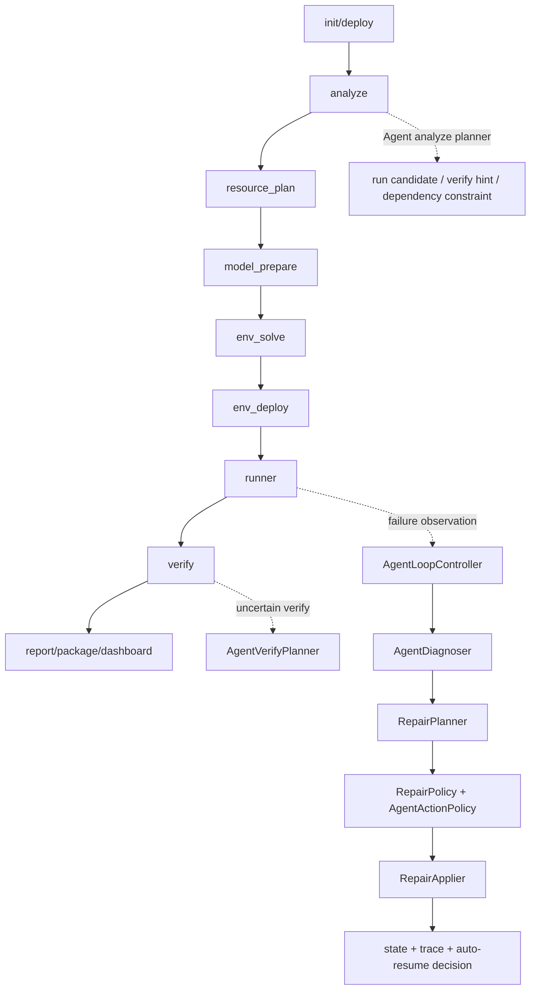

# AI-Auto-Harness Agent 架构说明

## 核心定位

AI-Auto-Harness 是一个面向开源模型项目的自动部署 Agent。它不是让 LLM 直接接管机器，而是把 LLM 放在 deterministic pipeline 旁边，作为受控 planner / diagnoser / verifier adviser 使用。

核心原则：

- LLM 不直接执行命令。
- LLM 不直接判定部署成功。
- LLM 输出只作为 policy-gated typed action。
- Python 控制器负责状态机、证据校验、命令白名单、resume 和审计。

## Pipeline



## LLM 决策点

当前 LLM 参与点分为三类：

- Analyze planner：读取文件树、selected files、skill 上下文和 deterministic analysis，提出 `add_run_candidate`、`select_run_candidate`、`update_verify_hint`、`add_dependency_constraint`。
- Log diagnoser：在 stage failed/uncertain 且 deterministic diagnosis 低置信时，输出结构化 root cause、repair actions、`rerun_from` 和 `rerun_reason`。
- Verify planner：当初次 verify uncertain 且服务仍存活时，输出多个 `verify_candidates`，由 Python 逐个做 method/path/trace/token policy 检查。

LLM 的价值是补充不确定信息：识别项目启动入口、解释日志、猜测 API shape、建议安全重跑点。最终合并、执行和成功判定都由 Python 决定。

## Deterministic Controller 职责

`TaskRunner` 和各阶段 module 负责主控制流：

- 生成和保存 `task.json`、`state.json`、`events.jsonl`。
- 顺序执行 analyze/resource/model/env/runner/verify/report。
- 维护 `last_safe_stage` 和 resume stage。
- 选择 skill、写入 `control_context`。
- 对下载、环境求解、服务启动、verify 证据做 deterministic 判断。
- 在失败或 uncertain 时调用 `AgentLoopController`。

`AgentLoopController` 收敛 observe-decide-act-verify loop：

- 构造 observation。
- 调用 `AgentDiagnoser`。
- 生成 deterministic repair plan。
- 通过 repair policy 和 loop gate。
- 在 `gated_actor` 且 runtime policy 允许时执行受控 repair。
- 产出 `should_auto_resume`、`next_rerun_from`、`stop_reason`。
- 写入 `logs/agent_loop/` 和 stage result 摘要。

## Policy Gate 职责

Agent action 进入系统前必须通过 policy：

- action type 必须在当前模式允许列表内。
- command 必须是 list，不允许 shell metachar。
- run candidate 不允许 `bash/sh/curl/wget/powershell` 等 shell/network executable。
- verify hint 必须包含 `{{trace_id}}`。
- `install_package` 只能在 `gated_actor` 且 `allow_dependency_install=true` 时出现。
- package spec 不能包含 URL、路径、`git+`、extra index、trusted host 等高风险内容。
- source edit、operator secret、service restart 等能力必须由 runtime policy 或人工审批显式允许。

## Action Schema

LLM 输出会被解析为 typed action：

```json
{
  "type": "update_verify_hint",
  "reason": "Gradio config shows /predict API",
  "confidence": 0.82,
  "payload": {
    "verify_hint": {
      "method": "POST",
      "path": "/api/predict",
      "json": {"data": ["{{trace_id}}"]}
    }
  },
  "requires": {}
}
```

常见 action：

- `select_run_candidate`
- `add_run_candidate`
- `update_verify_hint`
- `add_dependency_constraint`
- `install_package`
- `rerun_from_stage`
- `request_env_var_name_only`

## State / Resume 机制

状态文件由 `StateStore` 维护：

- 每个 stage 有 status、summary、data、evidence。
- `last_safe_stage` 用于确定失败后最早安全重跑点。
- repair plan 会计算 `rerun_from_required`、`rerun_from_proposed`、`rerun_from_effective`。
- 如果 LLM 提议的 `rerun_from` 非法或晚于安全阶段，Python 会降级到 required stage。
- auto-resume 默认受 `agent_auto_resume_after_repair`、runtime policy、repair policy 和 action 执行结果共同约束。

## Verify 机制

Verify 不接受“HTTP 200 即成功”。成功必须来自强证据：

- HTTP response 或产物中包含当前 trace id。
- 每次 verify attempt 保存独立 evidence JSON。
- LLM verify planner 只能提出候选请求，Python 负责 token/path/method/trace 检查。
- 支持 Gradio `/config` discovery、queue follow-up、Streamlit/browser DOM trace、OpenAPI schema、OpenAI-compatible `/v1/models` 和 streaming trace。
- 文件产物必须是当前 trace 后产生或修改，且可读、非空并记录 size/sha256。

## Failure Loop

失败闭环是：

```text
stage failed/uncertain
-> remember issue
-> retrieve similar memory
-> LLM/deterministic diagnosis
-> repair plan
-> policy gate
-> controlled apply or stop
-> rerun decision
-> verify evidence
-> metrics/report
```

Memory promotion 不会把失败 workaround 直接固化为 skill。只有 verified success memory 才能生成 promotion proposal：必须有 trace id、repair action hash、regression case，并且没有 high-risk policy reject。
