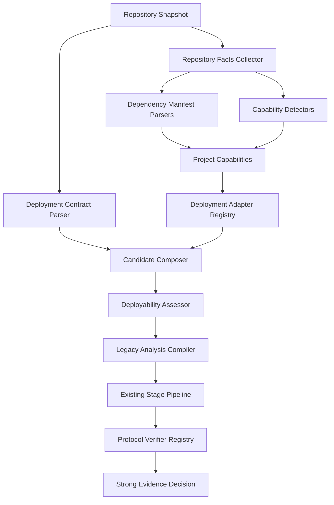

# 通用自动部署基础闭环执行方案

## 1. 文档信息

- 状态：待评审
- 制定日期：2026-08-30
- 执行范围：原总方案 Phase 0～Phase 4
- 目标版本：建议 `0.4.x`～`0.5.x`
- 前置条件：当前 `auto-deploy-harness` 主干测试可运行
- 后续文档：`docs/universal-deployment-expansion-execution-plan.md`
- 导航索引：`docs/universal-framework-auto-deployment-optimization-plan.md`

## 2. 本文档的执行目标

本文档只完成“未知框架也能被安全描述和验证”的基础闭环：

```text
Repository Facts
→ Project Capabilities
→ auto-deploy.yaml
→ Deployment Adapter Registry
→ Deployment Candidate
→ Command Authorization
→ Protocol Verifier Registry
→ Strong Evidence
```

完成后应达到：

1. analyzer 不再把单一 `frameworks` 当作全部部署能力。
2. `torch`、`transformers` 等 ML 库与服务框架、协议、语言生态分开建模。
3. 未知框架项目可以通过安全的 `auto-deploy.yaml` 描述完整部署方案。
4. 现有 Gradio、Streamlit、FastAPI、Flask、stdlib HTTP、vLLM 路径迁移到 Adapter Registry。
5. Verify 由协议与强 evidence 驱动，而不是只依赖框架名。
6. 旧的 `analysis` 字段继续兼容，不立即切换默认控制链。

本文档不负责：

- README/Make/自定义 CLI 的全面未知入口扩展。
- LLM unknown fallback。
- JVM、Go、Rust 部署。
- 默认启用新控制链。
- 删除旧 analyzer 兼容字段。

以上内容由第二份执行文档负责。

## 3. 必须保持的不变量

以下条件在任何提交中都不能被降低：

1. LLM 不直接执行命令。
2. Manifest 和 Adapter 只能产生候选，不能直接授权。
3. 所有命令使用 argv 数组，禁止 shell 拼接字符串。
4. 项目命令统一进入现有 `CommandAuthorizationEngine`。
5. README、Manifest、源码和依赖文件均是不可信输入。
6. 人工审批不能覆盖 `hard_denied`。
7. Readiness 不等于部署成功。
8. HTTP 200、端口开放和进程存活不能单独通过 Verify。
9. 最终成功必须绑定当前 task、repository、operation 和 trace evidence。
10. 现有通过用例不得在没有迁移说明时变为 uncertain/failed。

## 4. 当前基线

### 4.1 已有能力

当前项目已经具备：

- `ProjectAnalyzer` 的文件、依赖、框架、入口和 verify hint 分析。
- Plan-first `ProjectSnapshotBuilder`。
- `CommandDiscoveryService` 和 `CommandRegistry`。
- Python CLI、Node、Make、Repository Script command adapters。
- `CommandAuthorizationEngine`、候选选择、审批和执行前复验。
- LLM Deployment Plan schema、policy 和 compiler。
- Runner readiness 与 Verify trace evidence。
- Gradio、Streamlit、OpenAPI、OpenAI-compatible 等验证路径。

本执行方案必须复用这些能力，不创建第二套命令授权或第二套 Plan-first 主链。

### 4.2 已知缺口

当前 `frameworks` 混合：

```text
服务框架 + UI 框架 + ML 库 + 推理运行时 + 协议 + 语言生态
```

当前 analyzer 还存在：

- 关键词 substring 误判风险。
- 固定文件名入口覆盖不足。
- 框架检测、启动候选与 Verify 默认值耦合。
- 未知框架缺少明确 capability gaps。
- Verify 选择逻辑集中在大型模块中。

## 5. 目标架构



建议新增目录：

```text
src/auto_harness/capabilities/
  __init__.py
  schemas.py
  evidence.py
  dependency_parser.py
  detector.py
  assessor.py
  legacy_compiler.py

src/auto_harness/deployment_contract/
  __init__.py
  schema.py
  parser.py
  validator.py
  compiler.py
  evidence.py

src/auto_harness/deployment_adapters/
  __init__.py
  base.py
  registry.py
  generic_python.py
  gradio.py
  streamlit.py
  fastapi.py
  flask.py
  stdlib_http.py
  vllm.py
  openai_compatible.py
  node.py

src/auto_harness/verify/protocols/
  __init__.py
  base.py
  registry.py
  http_trace.py
  openapi.py
  openai_compatible.py
  browser_dom.py
```

## 6. 目标领域模型

### 6.1 ProjectCapabilities

```python
@dataclass
class ProjectCapabilities:
    languages: list[str]
    package_ecosystems: list[str]
    service_frameworks: list[str]
    ui_frameworks: list[str]
    ml_libraries: list[str]
    inference_runtimes: list[str]
    protocols: list[str]
    workload_types: list[str]
    build_systems: list[str]
    evidence: list["CapabilityEvidence"]
```

分类示例：

| 信号 | 分类 |
|---|---|
| Python | language |
| pip/uv/conda | package ecosystem |
| FastAPI/Flask | service framework |
| Gradio/Streamlit | UI framework |
| torch/transformers | ML library |
| vLLM | inference runtime |
| HTTP/OpenAPI/OpenAI-compatible | protocol |
| npm/pnpm/yarn | package ecosystem |
| Maven/Gradle | build system，第一份文档只允许识别，不执行 |

### 6.2 CapabilityEvidence

```python
@dataclass(frozen=True)
class CapabilityEvidence:
    evidence_id: str
    capability_type: str
    capability_value: str
    source_type: str
    path: str
    sha256: str
    line_start: int = 0
    line_end: int = 0
    confidence: float = 0.0
    reason: str = ""
```

要求：

- 每个 capability 必须至少引用一个 evidence。
- 依赖声明强于 README 文本。
- AST import 强于普通 substring。
- README 中提到竞品不能形成高置信框架检测。
- 文件 hash 变化后旧 evidence 失效。

### 6.3 DeploymentCandidate

```python
@dataclass
class DeploymentCandidate:
    candidate_id: str
    source: str
    adapter_ids: list[str]
    environment_candidate_id: str
    install_candidate_ids: list[str]
    setup_candidate_ids: list[str]
    run_candidate_id: str
    expected_port: int
    protocol_hints: list[str]
    verify_candidate_ids: list[str]
    required_backend: str
    confidence: float
    evidence_ids: list[str]
    missing_capabilities: list[str]
    score_reasons: list[str]
```

约束：

- 项目命令优先引用 `CommandRegistry` candidate id。
- Adapter 不直接在 Candidate 中嵌入任意 shell。
- 同一候选必须绑定 environment candidate。
- 缺少端口或 Verify 时允许形成 partial candidate，但不能执行为成功。

### 6.4 DeployabilityAssessment

```python
@dataclass
class DeployabilityAssessment:
    status: str
    selected_candidate_id: str
    candidate_ids: list[str]
    missing_capabilities: list[str]
    risk_reasons: list[str]
    next_resolution: str
```

允许状态：

```text
ready
partial
blocked
needs_approval
```

第一份文档中的 `next_resolution` 允许：

```text
compile
contract_required
repository_discovery
approval
human_input
```

`llm_plan` 在第二份执行文档中接入。

## 7. Analysis Schema v2

目标输出：

```json
{
  "schema_version": 2,
  "files": [],
  "capabilities": {},
  "capability_evidence": [],
  "dependency_manifests": [],
  "deployment_contract": {},
  "deployment_candidates": [],
  "deployability": {},
  "frameworks": [],
  "install_plan": [],
  "run_candidates": [],
  "verify_hint": {},
  "deterministic_facts": {},
  "legacy_compatibility": {
    "compiled": true,
    "warnings": []
  }
}
```

兼容要求：

- `frameworks` 暂时保留。
- `install_plan`、`run_candidates`、`verify_hint` 暂时保留。
- 新模型先生成，旧字段由 `LegacyAnalysisCompiler` 编译。
- 旧字段不能反向覆盖 capability 真值。
- Runner/Verify 默认仍消费兼容输出，直到第二份文档的 rollout 阶段。

## 8. Phase A0：建立基线

### 8.1 目标

在修改生产逻辑前固定当前行为和安全门槛。

### 8.2 Fixture 矩阵

至少覆盖：

```text
existing_gradio
existing_streamlit
existing_fastapi
existing_flask
existing_stdlib_http
existing_openai_compatible
existing_vllm_fake
unknown_python_with_app_py
unknown_python_without_entrypoint
node_package_without_run_candidate
ambiguous_python_entrypoints
malicious_readme
preexisting_port_listener
old_trace_response
```

### 8.3 基线状态

每个 fixture 记录：

```text
recognized
startable
verifiable
verified
```

以及：

```text
frameworks
install_plan
run_candidates
selected_candidate
authorization verdict
runner status
verify status
failure reason code
```

### 8.4 指标

```text
dependency_detection_rate
run_candidate_recall
correct_top1_candidate_rate
authorization_pass_rate
service_start_rate
strong_verify_pass_rate
false_success_count
unsafe_command_execution_count
```

### 8.5 测试命令

提交实现前应根据仓库实际测试入口选择最小门；至少运行：

```bash
PYTHONPATH=src python3 -m pytest tests/test_core.py
PYTHONPATH=src python3 -m pytest tests/test_llm_plan_first_schema.py tests/test_llm_plan_policy.py tests/test_llm_plan_compiler.py
```

如果仓库标准脚本覆盖更多门禁，应以标准脚本为准。

### 8.6 完成标准

- 基线可重复运行。
- 所有 artifact 绑定 commit、config 和 fixture hash。
- `false_success_count == 0`。
- `unsafe_command_execution_count == 0`。
- 每个非成功案例有稳定 reason code。

### 8.7 Commit

```text
test(runtime): 建立通用部署能力基线与未知框架用例
```

该提交不得包含 analyzer 重构。

## 9. Phase A1：能力模型与兼容编译

### 9.1 RepositoryFactsCollector

职责：

- 收集 bounded file tree。
- 识别 dependency/build metadata 文件。
- 读取受限、脱敏内容。
- 产生 file hash 和 source location。
- 不判断部署成功。

### 9.2 Dependency Manifest Parser

首期解析：

- `requirements.txt`
- `pyproject.toml`
- `environment.yml` / `environment.yaml`
- `package.json`

解析原则：

- 解析 package name，不对整仓库裸 substring。
- 保留 version、extras、marker 和 source file。
- 解析失败写 `parse_failed`，不能静默跳过。
- lockfile 作为单独 evidence。
- 不自动安装解析结果。

### 9.3 Python Import Detector

使用 AST 检测：

```text
import gradio
from fastapi import FastAPI
```

不应把以下内容当成高置信 import：

- 注释。
- README 示例。
- 普通字符串。
- 测试 fixture 中不参与运行的对比代码。

### 9.4 LegacyAnalysisCompiler

映射：

```python
frameworks = sorted(set(
    capabilities.service_frameworks
    + capabilities.ui_frameworks
    + capabilities.ml_libraries
    + capabilities.inference_runtimes
))
```

原有扩展标签按兼容规则保留：

```text
http.server
openai_compatible
node
unknown
```

### 9.5 测试

- 依赖解析 unit tests。
- Python AST import tests。
- capability evidence hash tests。
- framework compatibility golden tests。
- `torch` 不产生 service entrypoint 的测试。
- README 竞品文本误判测试。
- invalid TOML/YAML/JSON reason code 测试。

### 9.6 完成标准

- 现有测试全部通过。
- 当前已支持项目的旧 analysis 输出保持兼容。
- 新 capability 分类和 evidence 可在报告 artifact 中检查。
- 默认执行路径不改变。

### 9.7 Commit

```text
feat(planner): 引入项目部署能力模型与兼容分析输出
```

建议正文：

```text
- 增加语言、生态、框架、模型库、运行时与协议能力分类
- 使用结构化依赖和 Python AST 生成可追溯检测证据
- 通过 Legacy Compiler 保持旧分析字段兼容
- 增加能力分类、误判防护和新旧 schema 回归测试
```

## 10. Phase A2：显式部署契约

### 10.1 文件名与优先级

首期只支持仓库根目录：

```text
auto-deploy.yaml
```

优先级：

```text
operator override
> valid auto-deploy.yaml
> machine-readable repository metadata
> adapter defaults
```

Manifest 优先级高不等于获得安全豁免。

### 10.2 Schema v1

```yaml
schema_version: 1

project:
  workload_type: service
  runtime_family: python

environment:
  backend: venv
  python: "3.11"
  dependency_files:
    - requirements.txt
  install_commands:
    - [python3, -m, venv, .venv]
    - [.venv/bin/python, -m, pip, install, -r, requirements.txt]

service:
  command: [.venv/bin/python, app.py]
  cwd: .
  host: 0.0.0.0
  port: 8000
  startup_timeout_seconds: 60
  required_env_names: []

verify:
  protocol: http
  request:
    method: POST
    path: /api/infer
    json:
      prompt: "{{trace_id}}"
  success:
    response_contains: "{{trace_id}}"
  timeout_seconds: 20

security:
  required_backend: docker
  network_profile: none
  allow_source_edit: false
```

### 10.3 Validator

必须拒绝：

- 未知 `schema_version`。
- shell 字符串命令。
- 空 argv。
- shell metacharacter。
- `../` 或绝对路径逃逸。
- 外部 Verify URL。
- 明文 token/key/password。
- privileged、host network、Docker socket。
- 未声明端口的 service workload。
- 强验证缺少 trace 或 artifact contract。

### 10.4 Command Registry 接入

Manifest 命令转换为：

```text
CommandEvidence(source_type=manifest_command)
CommandCandidate(source_kind=manifest_command)
```

随后必须进入：

```text
CommandAuthorizationEngine
→ approval/rejection/allow
→ execution-time revalidation
```

禁止 `ManifestCompiler` 直接把命令写入可执行 `install_plan/run_candidates` 而绕过 registry。

### 10.5 Hash 绑定

Manifest hash 必须进入：

- repository fingerprint。
- Project Snapshot grounding。
- Command Evidence。
- Plan policy result。
- approval operation id。
- execution-time revalidation。

Manifest 修改后，旧 Plan、旧审批、旧 candidate decision 全部失效。

### 10.6 Fixture

```text
unknown_python_manifest_valid
manifest_custom_port
manifest_multiple_dependency_files
manifest_shell_string
manifest_path_traversal
manifest_external_verify_url
manifest_secret_value
manifest_stale_approval
manifest_missing_trace
```

### 10.7 完成标准

- 未知 Python HTTP fixture 通过 Manifest 达到 strong verify。
- Manifest 无法降低 command/path/network/verify policy。
- Manifest 改动后旧授权不再有效。
- Report 只保存脱敏 effective contract。

### 10.8 Commit

首选一个闭环提交：

```text
feat(policy): 增加声明式部署契约与安全校验
```

如果改动过大，拆为：

```text
feat(planner): 增加声明式部署契约解析
feat(policy): 将部署契约命令接入统一授权
```

## 11. Phase A3：Deployment Adapter Registry

### 11.1 Adapter Protocol

```python
class DeploymentAdapter(Protocol):
    adapter_id: str
    priority: int

    def detect(self, context: DetectionContext) -> AdapterDetection: ...
    def propose_environment(self, context, detection) -> list[EnvironmentProposal]: ...
    def propose_run_candidates(self, context, detection) -> list[RunProposal]: ...
    def propose_verify_candidates(self, context, detection) -> list[VerifyProposal]: ...
```

### 11.2 Adapter 限制

Adapter：

- 不执行 subprocess。
- 不访问网络。
- 不读取仓库外路径。
- 不直接修改 analysis。
- 不授权命令。
- 不判定部署成功。
- 必须产生 evidence-backed detection。

### 11.3 Registry

```python
class DeploymentAdapterRegistry:
    def register(self, adapter: DeploymentAdapter) -> None: ...
    def all(self) -> list[DeploymentAdapter]: ...
    def detect_all(self, context: DetectionContext) -> list[AdapterDetection]: ...
```

顺序：

```text
priority DESC
adapter_id ASC
```

首期仅允许内置 Adapter，不开放第三方 entry point。

### 11.4 第一批迁移

```text
GenericPythonAdapter
GradioAdapter
StreamlitAdapter
FastAPIAdapter
FlaskAdapter
StdlibHttpAdapter
VllmAdapter
OpenAICompatibleAdapter
NodePackageAdapter
```

### 11.5 多 Adapter 合并

示例：

```text
FastAPIAdapter
+ Torch capability
+ Transformers capability
+ OpenAPI protocol
```

合并规则：

1. 不将不同能力类别互相覆盖。
2. 多个入口保留为多个 candidate。
3. 高优先级来源只覆盖同一字段。
4. 端口冲突形成 capability gap。
5. 相同 argv 去重但合并 evidence 和 score reason。

### 11.6 Candidate Composer

组合：

```text
environment proposal
+ run proposal
+ protocol/verify proposal
+ security/backend requirement
→ DeploymentCandidate
```

候选必须显式列出：

- source。
- adapter ids。
- evidence ids。
- confidence。
- missing capabilities。
- score reasons。

### 11.7 测试

- 单 Adapter detection。
- Registry 稳定顺序。
- 多 Adapter capability 合并。
- 重复 command 去重。
- 端口冲突。
- Adapter 不能改变 Policy verdict。
- 旧 analyzer golden compatibility。

### 11.8 完成标准

- 所有现有框架规则已通过 Adapter 表达。
- 现有 E2E 无未批准回归。
- Adapter 输出完全可追溯。
- 旧 analyzer 入口仍可使用。

### 11.9 Commit

小规模时：

```text
feat(runtime): 引入可注册的部署适配器
```

推荐实际拆分：

```text
feat(runtime): 引入部署适配器注册与候选合并
feat(runtime): 将 Python Web 框架迁移到部署适配器
feat(runtime): 将模型运行时与 Node 检测迁移到部署适配器
```

## 12. Phase A4：Protocol Verifier Registry

### 12.1 ProtocolVerifier

```python
class ProtocolVerifier(Protocol):
    verifier_id: str
    protocols: tuple[str, ...]

    def supports(self, candidate, analysis) -> bool: ...
    def build_probe(self, trace_id, candidate, verify_spec) -> Probe: ...
    def execute_probe(self, probe, runtime) -> ProbeEvidence: ...
    def evaluate(self, evidence, expectation) -> VerifyDecision: ...
```

### 12.2 第一批 Verifier

```text
HttpTraceVerifier
OpenAPITraceVerifier
OpenAICompatibleVerifier
GradioVerifier
StreamlitBrowserVerifier
BrowserDomTraceVerifier
```

### 12.3 Readiness 与 Verify

状态关系：

| 条件 | Runner | Verify | Deployment |
|---|---|---|---|
| 进程退出 | failed | not run | failed |
| 进程活、端口未开 | uncertain/failed | not run | failed/uncertain |
| 端口开、无强证据 | passed | uncertain | not successful |
| 当前 trace 强证据 | passed | passed | successful |

### 12.4 Verifier 选择优先级

```text
operator
> valid manifest
> discovered service metadata
> adapter deterministic default
> repository evidence
```

LLM verify fallback 在第二份执行文档接入。

### 12.5 强 evidence

HTTP 类验证必须保证：

- 请求发往当前 runner 发现的本地服务。
- 使用当前不可预测 trace id。
- 响应或受支持 artifact 包含当前 trace。
- evidence 写入当前 run 的 evidence 目录。
- trace、port、pid/container、operation id 可关联。

以下证据无效：

- 裸 HTTP 200。
- 端口 open。
- 进程 alive。
- 旧 trace。
- 其他服务的响应。
- LLM 文本判断。

### 12.6 防误报测试

```text
old_trace_rejected
bare_http_200_rejected
preexisting_listener_rejected
wrong_port_rejected
process_exit_after_ready_rejected
external_url_rejected
trace_in_request_but_not_response_rejected
current_trace_response_passed
```

### 12.7 完成标准

- 已有 verifier 经 registry 选择。
- Django/Sanic/Go 等未来 Adapter 可以复用 HTTP verifier。
- Verify 强度不低于当前实现。
- verifier 选择原因进入 artifact/report。
- false success 保持为 0。

### 12.8 Commit

```text
feat(verify): 按服务协议选择强证据验证器
```

建议正文：

```text
- 增加协议验证器注册与稳定选择顺序
- 将 HTTP、OpenAPI 与 OpenAI-compatible 探测迁出框架分支
- 分离 readiness 和强证据 verify 状态
- 拒绝旧 trace、裸 HTTP 200 和错误端口监听者
- 增加协议选择、证据校验和兼容回归测试
```

## 13. 第一份文档的集成顺序

严格按以下顺序执行：

```text
A0 基线
→ A1 能力模型，只 shadow
→ A2 Manifest
→ A3 Adapter Registry
→ A4 Protocol Verify
→ Foundation Handoff
```

禁止：

- 在 A0 前重构 analyzer。
- 在 A1 中切换默认执行。
- 在 A2 中让 Manifest 绕过 Command Authorization。
- 在 A3 中删除 legacy output。
- 在 A4 中降低 Verify 标准。

## 14. 配置建议

新增配置先默认 shadow/off：

```json
{
  "deployment_capability_mode": "shadow",
  "deployment_contract_enabled": true,
  "deployment_adapter_registry_enabled": false,
  "protocol_verify_registry_enabled": false
}
```

逐阶段调整：

1. A1：capability shadow 开启。
2. A2：contract parser 开启，执行仍需显式 allow flags。
3. A3：adapter registry shadow。
4. A4：protocol verifier shadow compare。
5. 第二份文档 rollout 前不默认 enforce。

## 15. 审计产物

第一份文档完成后，每次 run 至少产生：

```text
runs/<task-id>/reports/project_capabilities.json
runs/<task-id>/reports/capability_evidence.json
runs/<task-id>/reports/deployment_contract.json
runs/<task-id>/reports/adapter_detections.json
runs/<task-id>/reports/deployment_candidates.json
runs/<task-id>/reports/deployability_assessment.json
runs/<task-id>/reports/protocol_verify_selection.json
```

要求：

- secret redaction。
- repository fingerprint。
- config hash。
- schema version。
- deterministic serialization。

## 16. 第一份文档测试门

### 16.1 Unit

- Schema/parser/validator。
- Dependency parser。
- AST detector。
- Adapter detection。
- Candidate composer。
- Legacy compiler。
- Protocol verifier selection/evaluation。

### 16.2 Policy

- Manifest shell/path/network rejection。
- Command Registry binding。
- stale evidence/approval rejection。
- Adapter 不能改变 verdict。

### 16.3 Integration

- ProjectAnalyzer v2 + legacy output。
- Manifest → registry → policy → compiler。
- Adapter → candidate → runner dry run。
- Runner readiness → verifier → evidence。

### 16.4 E2E

- 现有 Gradio/Streamlit/FastAPI 回归。
- unknown Python + Manifest verified success。
- malicious Manifest blocked。
- HTTP false success 防护。

### 16.5 通过条件

```text
existing_regression_pass == true
unknown_manifest_verified == true
false_success_count == 0
unsafe_command_execution_count == 0
secret_leak_count == 0
```

## 17. Foundation Handoff Contract

第二份文档开始前，第一份必须交付以下稳定接口：

1. `ProjectCapabilities` schema 已版本化。
2. `CapabilityEvidence` 可重验。
3. `DeploymentCandidate` 可引用 Command Registry。
4. `DeployabilityAssessment` 能列出缺口和下一动作。
5. `DeploymentAdapterRegistry` 顺序稳定。
6. `ProtocolVerifierRegistry` 顺序稳定。
7. `LegacyAnalysisCompiler` 可生成现有 pipeline 输入。
8. Manifest 命令已进入统一授权。
9. 强证据 Verify 无降级。
10. Shadow artifact 能比较新旧结果。

建议写入 handoff artifact：

```text
docs/evidence/universal-deployment-foundation-handoff.json
```

内容至少包括：

```json
{
  "schema_version": 1,
  "commit": "<current-commit>",
  "config_hash": "<hash>",
  "capability_schema_version": 2,
  "contract_schema_version": 1,
  "adapter_registry_version": 1,
  "verifier_registry_version": 1,
  "tests": {},
  "false_success_count": 0,
  "unsafe_command_execution_count": 0
}
```

第二份执行文档必须先校验该 handoff；缺失或过期时不得直接执行 rollout。

## 18. 第一份文档完成定义

只有满足以下条件才算完成：

- [ ] 能力模型与旧字段兼容编译已落地。
- [ ] Manifest 可以使未知 Python 服务达到 verified success。
- [ ] Manifest 不能绕过安全策略。
- [ ] 现有框架已迁移到 Adapter Registry。
- [ ] Verify 已按协议注册并保持强 evidence。
- [ ] 所有基线和安全测试通过。
- [ ] Foundation Handoff artifact 已生成并绑定当前 commit。
- [ ] 默认控制链尚未在没有第二份 rollout 门禁时强制切换。

## 19. Commit 风格

遵循仓库近期格式：

```text
<type>(<scope>): <中文动宾短语>
```

本执行文档推荐的核心提交：

```text
test(runtime): 建立通用部署能力基线与未知框架用例
feat(planner): 引入项目部署能力模型与兼容分析输出
feat(planner): 增加声明式部署契约解析
feat(policy): 将部署契约命令接入统一授权
feat(runtime): 引入部署适配器注册与候选合并
feat(runtime): 将 Python Web 框架迁移到部署适配器
feat(runtime): 将模型运行时与 Node 检测迁移到部署适配器
feat(verify): 按服务协议选择强证据验证器
```

每个提交必须：

- 实现与相关测试同提交，基线测试除外。
- 可独立验证和回滚。
- 不包含无关格式化和顺手修复。
- Policy/Verify 变更明确说明如何证明没有安全降级。
